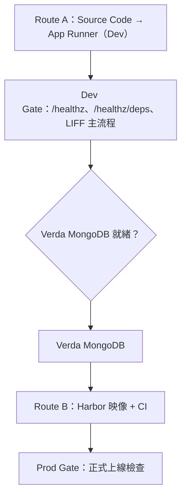

# LINE Mini App 內部部署 Runbook（上線優先版）

> 目標：你可以**快速、正確上線**  
> 專案條件：Vue + TypeScript / Express + TypeScript / OpenAI 必接 / **資料層：Verda MongoDB（不再使用 Firestore）**  
> 命名：`henrylive`

---

## 整體路線圖（先打通 Dev，再正式化）




1. 先用 **Route A（App Runner Source Code）** 部署前後端到 Verda Dev。
2. 前端只打後端 API，不直連 OpenAI。
3. 後端先驗證 OpenAI 可用，再驗證 Verda MongoDB 可用性。
4. 資料層就緒且 Dev Gate 全綠後，再切 **Route B（Harbor 映像 + CI）** 上 Prod。

---

## 前置條件

### 必備條件（沒過就不要往下）

- Verda Dev / Prod 皆可建立 App Runner 與 Secret
- OpenAI 服務 API Key 已完成流程（利用相談 + WFPF）
- LIFF / Mini App 可登記 Dev 與 Prod 網域
- 後端有 `GET /healthz` 與 `GET /healthz/deps`
- 前端 API Base URL 可用 env 注入（非硬編碼）

### 網域與環境命名（固定規格）

- Frontend Dev: `henrylive-miniapp-dev.<your-domain>`
- Backend Dev: `henrylive-api-dev.<your-domain>`
- Frontend Prod: `henrylive-miniapp.<your-domain>`
- Backend Prod: `henrylive-api.<your-domain>`

前端 env：

- Dev: `VITE_API_BASE_URL=https://henrylive-api-dev.<your-domain>`
- Prod: `VITE_API_BASE_URL=https://henrylive-api.<your-domain>`

---

## Route A：Source Code 直上（開發環境最快路線）

### 取得對外 URL 與綁定自訂網域（Mini App / LIFF 必做）

Mini App 與 LIFF 白名單需要的是 **瀏覽器可開、HTTPS 可連** 的前端網址。實務上幾乎一定是：**App Runner 提供服務本體**，對外 **穩定網名** 則多半靠 **Verda Load Balancer + DNS + TLS**（細節與例外見附錄 B）。請依序做：

#### 階段 A：先拿到「可連線的 URL」（打通流程用）

1. 在 **Verda**（Dev 或 Prod，勿混用環境）建立並部署 App Runner，直到狀態為 **Running / Healthy**（或你司畫面上等同「已就緒」）。
2. 開啟該 **App Runner 應用詳情**，找到平台顯示的 **對外存取位址**（常見名稱如 *URL*、*Endpoint*、*Ingress*、*Access URL*；實際用詞以介面為準）。
  - 這通常是 **先可測試的預設網址**（未必已是 `henrylive-...` 自訂網名）。
3. 用瀏覽器開 `https://...`，確認前端首頁 **HTTP 200**，且 **憑證有效**（瀏覽器不報錯）。
4. **後端**亦同：在後端 App Runner 詳情取得 **API 的對外 base URL**，用 `curl` 或瀏覽器測 `GET /healthz` 為 **200**。

> **為什麼要先做這段**：自訂網域與憑證常需額外申請與 DNS 生效時間；先用預設 URL 可並行驗證 build、port、health check、CORS、OpenAI、DB。

#### 階段 B：綁定你要的網名（`henrylive-...`）

目標是讓使用者與 LIFF 使用例如：

- 前端 Dev：`https://henrylive-miniapp-dev.<your-domain>`
- 後端 Dev：`https://henrylive-api-dev.<your-domain>`
- （Prod 同理，見前置條件內命名）

**建議順序（與附錄 B.2 一致）：**

1. **確認憑證策略**：自訂 FQDN 的 HTTPS 通常需 **Voyager** 申請／登錄憑證，並確保 **Verda LB 端可使用**；若 Voyager 有、LB 選不到，依內部流程請 **#ext-help-verda** 協助掛上 LB（摘要句可參考附錄 B.1）。
2. **建立 Verda Load Balancer**（Mini App 前後端多為 **Proxy mode、TLS 終止在 LB**；表單欄位與 DSR 差異見附錄 B.3 / B.5）：
  - **Real server / backend** 指向該 App Runner 服務對應的 **origin**（實際綁定方式以你司 LB 文件為準：可能是 hostname、IP:port、或內部服務名）。  
  - **Health check** 路徑需與 App Runner 設定一致（前端靜態站可對 `/` 或 nginx 健康路徑；後端建議 `/healthz`）。
  - **Listener**：HTTPS（443）掛上該 FQDN 的憑證。
3. **DNS**：在 **該 FQDN 所屬 zone** 新增紀錄，把 `henrylive-miniapp-dev.<your-domain>`（及 API 子網名）指到 **LB 的 VIP** 或文件要求的目標。
  - 若網域落在 `***.workers-hub.com` zone**，通常 **無法**在 Verda DNS 儀表板直接改，需依內部流程（例如 **jopsdb** 等，見附錄 B.4）。  
  - 其他 zone 若可用 **Verda DNS**，請依 [Verda DNS Quickstart](https://verda-doc.linecorp.com/network/dns/quickstart/) 與你司規範操作。
4. **等待生效**後，用 `https://henrylive-miniapp-dev.<your-domain>` 再測一次首頁與 API；**更新後端 CORS**（`CORS_ORIGINS` 為前端 **HTTPS 完整 origin**）與 **前端 build 時的 `VITE_API_BASE_URL`**（指向後端 **HTTPS base**）。
5. **LIFF / Mini App 後台**：將 **最終要給使用者的前端 HTTPS URL**（含路徑若 LIFF 有要求）登錄至 **允許的網域／Endpoint 白名單**；變更後若客戶端仍舊快取，依 LINE 文件重開或等待生效。

#### 檢查清單（綁網域後必核）

- 前端：`https://henrylive-miniapp-dev...` 首頁 200、憑證有效  
- 後端：`https://henrylive-api-dev.../healthz` 200  
- 瀏覽器開前端時，Network 面板呼叫 API **無 CORS 錯誤**  
- LIFF / Mini App 白名單已含該前端網域（與 Prod 分開登錄）

---

### 後端（Express）- App Runner Dev

1. Verda Dev -> App Runner -> Create App
2. Source 選 `Source Code Repository`（GHE）
3. 設 Container Port（常見 `8080`）
4. 設 Health Check：`GET /healthz`
5. 設 env：
  - `NODE_ENV=development`
  - `PORT=8080`
  - `CORS_ORIGINS=https://henrylive-miniapp-dev.<your-domain>`（若尚未有自訂網名，可暫填預設 URL 的 origin，待階段 B 完成後改回正式網名並**重新部署**）
  - `OPENAI_BASE_URL=https://us.api.openai.com`
6. 設 secret：
  - `OPENAI_API_KEY`
  - `MONGODB_URI`（例如 Verda MongoDB 的 connection string）
7. 部署成功後，依 **「取得對外 URL 與綁定自訂網域」** 取得 API 的 **HTTPS base URL**；最終 `VITE_API_BASE_URL` 必須指向此 base。

必備程式條件：

```ts
const port = Number(process.env.PORT || 8080);
app.listen(port, "0.0.0.0");
```

### 前端（Vue）- App Runner Dev

1. Verda Dev -> App Runner -> Create App
2. Source Code 部署前端 repo（build／Dockerfile 依專案；見附錄 C）
3. 設 **build 時**注入的 `VITE_API_BASE_URL`：須為 **後端對外的 HTTPS base**（階段 A 可先用預設 API URL；階段 B 綁好 `henrylive-api-dev...` 後應改為該 URL 並**觸發重建／重部署**前端，否則仍會打到舊位址）
4. Container Port、Health Check 與 nginx／靜態站設定一致（常見由 Dockerfile 決定）
5. 依 **「取得對外 URL 與綁定自訂網域」** 取得前端 **HTTPS URL**，完成 **LIFF / Mini App 白名單** 登錄

---

## Dev Gate（開發環境必過檢查）

以下全部通過才算「Dev 打通」：

- 前端首頁 200
- 前端呼叫 `/healthz` 200
- `/healthz/deps` 顯示 `openai: ok`
- `/healthz/deps` 顯示 `db: ok`（正式環境：Verda MongoDB；測試期若仍用 Firestore 對照，見「轉換至 Verda (MongoDB)」一節的 Firestore → MongoDB 子段）
- LIFF WebView 主流程可完整跑完

`/healthz/deps` 建議回傳範例：

```json
{
  "status": "ok",
  "openai": "ok",
  "db": "ok"
}
```

---

## 轉換至 Verda (MongoDB)

因公司內部服務必須落在 Verda 內網，正式環境不再使用 Firestore。資料層統一走 **Verda MongoDB Service**（官方文件已有規格與 ACL 範例）。

實作建議：

1. 抽 repository adapter 層（例如 `UserRepository`、`ChatRepository`）。
2. 先在 Dev 接 Verda MongoDB，實作並驗證 Mongo 版。
3. 若歷史資料在 Firestore，寫一次性匯出／匯入腳本；正式環境只讀寫 Mongo。

### Firestore → MongoDB：測試期雙模式與轉換指南

**原則**

- **Prod / 公司 Verda 正式環境**：只接 **Verda MongoDB**，**不**部署、不設定 Firestore 相關 secret。  
- **本機或你個人可連外網的測試環境**：可暫時保留 **Firebase Admin + Firestore**，用來驗證既有邏輯，直到 Mongo 版行為對齊為止。

**為什麼要「雙模式」**：正式規定不能依賴 Firestore，但你要把已寫好的 Firestore 程式**逐步換成 Mongo**，中間需要一段**平行開發／對照測試**，用環境變數切換最有效率。

#### 建議環境變數


| 變數                              | 用途                                                         |
| ------------------------------- | ---------------------------------------------------------- |
| `DB_PROVIDER`                   | `切換 mongodb`（預設）或 `firestore`（測試）                          |
| `MONGODB_URI`                   | Verda MongoDB connection string（`DB_PROVIDER=mongodb` 時必填） |
| `FIREBASE_SERVICE_ACCOUNT_JSON` | Service Account JSON 字串（僅 `DB_PROVIDER=firestore` 時需要）     |


**實作注意**：啟動時若 `DB_PROVIDER=mongodb`，**不要**初始化 Firebase；若 `firestore`，**不要**連 Mongo。避免兩套都連、浪費連線或誤寫資料。

#### 程式架構（最有效率的換法）

1. **禁止**在 route / controller 裡直接呼叫 `admin.firestore()` 或 Mongo collection。
2. 為每個業務模組定 **Repository 介面**（例如 `saveMessage`、`listByUser`），介面只講「業務意義」，不講 Firestore 或 Mongo。
3. 實作兩個 class（過渡期）：`FirestoreXxxRepository`、`MongoXxxRepository`。
4. 用 factory 依 `DB_PROVIDER` 回傳其中一個。
5. **每換完一個模組**，在兩種模式下各跑一輪測試（或至少 Mongo 全綠後再刪 Firestore 實作）。

這樣你可以：**本機先繼續用 Firestore 跑舊行為**，同分支上**逐檔把實作換成 Mongo**，最後刪掉 Firestore 實作與依賴。

#### Firestore 與 MongoDB 概念對照（不是相容層，要手動對應）


| Firestore                  | MongoDB（慣例）                                             |
| -------------------------- | ------------------------------------------------------- |
| Collection                 | Collection                                              |
| Document ID                | `_id`（可用 `ObjectId` 或沿用字串 id）                           |
| Document 欄位                | BSON 欄位（型別更寬鬆，注意日期用 `Date`）                             |
| Subcollection              | 常改成 **獨立 collection** + `parentId`，或 **嵌套陣列／物件**（看查詢模式） |
| `where` + `orderBy`（需複合索引） | `find` + `sort` + **自建索引**（規則不同，要重想）                    |
| `array-contains`           | `$in` / `$elemMatch` 等                                  |
| Transaction                | `session.withTransaction`（multi-doc）                    |
| `batch` / `writeBatch`     | `bulkWrite` 或單筆 `insertOne`/`updateOne`                 |


**查詢**：Firestore 的查詢限制（不等式欄位數、複合索引）與 Mongo 不同；**不能**把 Firestore query 一對一翻譯，要依 Mongo 索引重新設計。

#### 建議替換順序（由外而內）

1. **盤點**：搜尋 `firestore(`、`collection(`、`doc(`、`getDoc`、`setDoc`、`updateDoc`、`query`、`where`、`runTransaction` 等。
2. **依模組切**：先換「讀多、寫少」或邊界清楚的模組（例如設定檔快取），再換核心交易路徑。
3. **每個模組完成**：在 Mongo 上補 **索引**（對應你最常用的 filter + sort）。
4. **資料遷移**（若 Firestore 已有正式資料）：寫 **一次性腳本**（export JSON / 逐 collection 拉取 → 轉成 BSON → `insertMany`），並在 Mongo 用 **dry-run** 驗證筆數與抽樣比對。
5. **切斷 Firestore**：Prod 只設 `DB_PROVIDER=mongodb`，移除 `firebase-admin` 中與 Firestore 相關初始化（若完全不用 Firebase 其他產品，可整包移除）。

#### 測試檢查清單（切 Mongo 前）

- 所有原 Firestore 路徑在 Mongo 有對應 collection／欄位約定  
- 讀寫路徑在 **壓力可接受** 的索引下完成（用 `explain` 抽查）  
- 若有 transaction，Mongo 版在 replica set 上驗證過  
- `/healthz/deps` 在 `DB_PROVIDER=mongodb` 時回報 `db: ok`  
- Prod 部署清單裡 **沒有** `FIREBASE_SERVICE_ACCOUNT_JSON`

---

## Route B：Harbor Image + CI（正式上線路線，實作版）

適用：你要可回滾、可審計、可穩定重複部署，且前後端都能 Docker 化。

### 建議基底 image

- **Backend (Express + TS)**：`node:18-alpine`（build 與 runtime 都穩定，體積較小）
- **Frontend (Vue/Vite)**：
  - build 階段：`node:18-alpine`
  - runtime 階段：`nginx:1.27-alpine`（純靜態檔最常見）

> 若你專案已固定 Node 20，請先確認 App Runner 建置／Runtime 與你依賴相容，再統一版本。

### Backend Dockerfile（建議）

假設後端在 `backend/`，建議建立 `backend/Dockerfile`：

```dockerfile
FROM node:18-alpine AS builder
WORKDIR /app
COPY package*.json ./
RUN npm ci
COPY . .
RUN npm run build

FROM node:18-alpine AS runtime
WORKDIR /app
ENV NODE_ENV=production
COPY package*.json ./
RUN npm ci --omit=dev
COPY --from=builder /app/dist ./dist
EXPOSE 8080
CMD ["node", "dist/index.js"]
```

### Frontend Dockerfile（建議，Vue 靜態站）

假設前端在 `frontend/`，建議建立 `frontend/Dockerfile`：

```dockerfile
FROM node:18-alpine AS builder
WORKDIR /app
COPY package*.json ./
RUN npm ci
COPY . .
RUN npm run build

FROM nginx:1.27-alpine
COPY --from=builder /app/dist /usr/share/nginx/html
EXPOSE 8080
CMD ["nginx", "-g", "daemon off;"]
```

> 若你需要前端 SPA 路由 fallback，請額外放入 nginx 設定（`try_files $uri /index.html;`）。

### 本機建置與測試指令（先確保 image 可跑）

```bash
# backend
docker build -f backend/Dockerfile -t henrylive-api:local backend
docker run --rm -p 8080:8080 --env PORT=8080 henrylive-api:local

# frontend
docker build -f frontend/Dockerfile -t henrylive-web:local frontend
docker run --rm -p 8081:8080 henrylive-web:local
```

### 推到 LINE Harbor（給 App Runner `Container Registry` 用）

**官方入口與文件（請以這裡為準）**


| 項目                                        | 網址                                                                                                                                                                                                                                                                                    |
| ----------------------------------------- | ------------------------------------------------------------------------------------------------------------------------------------------------------------------------------------------------------------------------------------------------------------------------------------- |
| Harbor Web UI（登入、建 Project、Robot Account） | [https://harbor.linecorp.com/](https://harbor.linecorp.com/)Input '`$okta_password,$okta_otp_code`' for the password. (Separated by **comma**)                                                                                                                                       |
| 公司 Harbor 總說明（login／push／tag／Robot／保留政策）  | [Facilities - Harbor (New Docker Registry)](https://wiki.workers-hub.com/pages/viewpage.action?pageId=114612786)                                                                                                                                                                      |
| Verda App Runner：映像來源限制                   | [Verda Doc — App Runner — From Source Code Setting → Container Registry](https://verda-doc.linecorp.com/compute/apprunner/specifications/source-setting/#container-registry)（Confluence 鏡像：[pageId=2751296794](https://wiki.workers-hub.com/pages/viewpage.action?pageId=2751296794)） |
| 支援窗口                                      | Slack **#ext-help-harbor**（見上列 Facilities 頁）                                                                                                                                                                                                                                          |


**「Repository 網址」是什麼？**

- LINE Harbor **不是** Git repository；沒有「一個像 github.com/xxx 的 Harbor clone URL」。
- 你推送的映像路徑格式為 Registry V2 慣例：  
`harbor.linecorp.com/<Harbor Project 名稱>/<映像 repository 名稱>:<tag>`  
在 Harbor UI 裡，**Project** 下會看到 **Repositories**；該列表中的路徑即為你要填進 App Runner 的 **Image URL**（含 tag 或 digest）。
- 若要在瀏覽器開專案列表：`https://harbor.linecorp.com/harbor/projects`（實際選單以 UI 為準）。

**Verda App Runner 硬性限制（必讀）**

- 文件載明：**Verda App Runner 目前僅支援映像在 [LINE Harbor](https://harbor.linecorp.com/)，且僅可使用 public project**（私有專案映像無法照此路線部署）。見上表 Verda 連結。

**推送前在 Harbor 必做的事**

1. 在 Harbor **建立 Project**（且符合你組織對 public/private 的規定；給 App Runner 用需 **public**）。未建 Project **無法** push。
2. 建議為 CI／本機自動化建立 **Robot Account**（專案管理員在 Project → Robot Accounts 建立）；**個人 Okta 帳號不能用於 image push**，且 LDAP 帳號 push 可能觸發 Duo 逐層驗證，官方建議自動化改用 Robot。見 Facilities 頁「Robot Account」「Pull & Push」章節。
3. 映像 **tag** 請帶語意化版本或 git sha；**未打 tag 的 artifact 可能依保留政策在一週內被刪**（Facilities 頁 Data Retention）。

`**docker login`（擇一）**

- **Robot（建議給 CI／腳本）**：`echo "$HARBOR_ROBOT_TOKEN" | docker login -u "$HARBOR_ROBOT_USER" --password-stdin harbor.linecorp.com`（username 含 `$` 時注意 shell 跳脫，見 Facilities FAQ）。
- **個人帳號（僅限需要時）**：CLI 可用「Okta 密碼 + OTP」合併為 password：`$okta_password,$okta_otp_code`（逗號分隔）stdin 給 `docker login`；**仍不應作為 push 主力**（見上）。

**建置、tag、push（範例；請替換成你的 Harbor Project 名稱）**

```bash
export HARBOR_HOST="harbor.linecorp.com"
# 在 Harbor UI 建立的 Project 名稱，例如你的團隊專案（須為 App Runner 允許的 public project）
export HARBOR_PROJECT="<your-harbor-project>"
export SHA="$(git rev-parse --short HEAD)"

export API_IMAGE="${HARBOR_HOST}/${HARBOR_PROJECT}/henrylive-api:dev-${SHA}"
export WEB_IMAGE="${HARBOR_HOST}/${HARBOR_PROJECT}/henrylive-web:dev-${SHA}"

docker login "${HARBOR_HOST}"

docker build -f backend/Dockerfile -t "${API_IMAGE}" backend
docker build -f frontend/Dockerfile -t "${WEB_IMAGE}" frontend

docker push "${API_IMAGE}"
docker push "${WEB_IMAGE}"
```

Prod 請另用例如 `henrylive-api:prod-${SHA}`，與 Dev tag 分開，便於回滾。

**App Runner 要填的 Image URL**

- 即上述 push 成功後的完整字串，例如：  
`harbor.linecorp.com/<your-harbor-project>/henrylive-api:dev-a1b2c3d`

### App Runner 設定（from image）

1. 後端 App Runner Source 選 `Container Registry`，Image URL 填 push 後的完整路徑（例：`harbor.linecorp.com/<your-harbor-project>/henrylive-api:dev-<sha>`）。
2. 前端 App Runner Source 選 `Container Registry`，Image URL 填 push 後的完整路徑（例：`harbor.linecorp.com/<your-harbor-project>/henrylive-web:dev-<sha>`）。
3. Container Port：
  - backend：`8080`
  - frontend：`8080`（因 nginx 暴露 8080）
4. 設 health check（後端建議 `/healthz`）。
5. 補 env / secret（`OPENAI_API_KEY`、`MONGODB_URI` 等）。
6. **對外 URL 與自訂網域**：與 Route A 相同，請依主線 **「取得對外 URL 與綁定自訂網域」** 完成 LB、DNS、TLS 與 LIFF 白名單；image 部署只解決「容器跑在哪」，不會自動給你 `henrylive-...` 網名。

### CI 最小建議

- 每次 merge 主要分支：build + push `dev-<sha>`，更新 Dev App Runner image URL。  
- release tag：build + push `prod-<sha>`，人工審核後更新 Prod App Runner image URL。  
- **不要只用 `latest`**，避免回滾困難。

---

## Prod 上線 Gate（正式環境必過檢查）

- Prod 網域與證書配置完成
- Prod secret 全部獨立（不可沿用 Dev）
- CORS 白名單為 Prod 前端網域
- `/healthz`、`/healthz/deps` 全綠
- Smoke test：登入、主流程、錯誤流程
- 回滾方案已演練（Route A: 回前一版設定 / Route B: 回前一個 image tag）

---

## OpenAI 實作（固定模式，Route A/B 都適用）

後端統一呼叫：

- Base URL: `https://us.api.openai.com`
- Secret: `OPENAI_API_KEY`

建議 env：

```bash
OPENAI_BASE_URL=https://us.api.openai.com
OPENAI_MODEL=<approved-model>
OPENAI_TIMEOUT_MS=30000
```

必做：

- timeout + retry（有限次）
- log 遮罩 key
- 不從前端直接呼叫 OpenAI

---

## 常見阻塞與最快排除

1. **LIFF 可開頁但 API 失敗**
  - 先查 `VITE_API_BASE_URL` 和 CORS
2. **App Runner 重啟循環**
  - 先查 port mismatch、health check path、Dockerfile 啟動命令
3. **OpenAI 401/403**
  - 先查 key、endpoint、申請範圍
4. **資料層 timeout / 連線失敗**
  - 先查 `MONGODB_URI`、Verda MongoDB ACL、索引與 driver；測試期若仍用 Firestore，再查憑證與網路（見「轉換至 Verda (MongoDB)」→ Firestore → MongoDB 子段）
5. **Dev ok / Prod fail**
  - 先比對 Prod secret、ACL、DNS、Harbor image tag 是否正確

---

## 需要你補充（補了可直接變成最終版）

- 後端 repo 的 `npm scripts`、Node 版本、啟動命令
- 前端 repo 的 build/serve 方式
- 最終 DNS zone 與憑證申請路徑
- Firestore → Mongo 遷移：各模組是否已換成 `MongoXxxRepository`、是否可刪除 Firestore 實作（見「轉換至 Verda (MongoDB)」一節）

---

## 延伸閱讀

- 本檔 **「整體路線圖」至「需要你補充」** 為上線 Runbook 主線，請優先照做；**「轉換至 Verda (MongoDB)」** 內含 Firestore 測試期與 Mongo 轉換專章。  
- **HTTPS／LB／DNS／憑證** 的必做流程已寫在 **Route A「取得對外 URL 與綁定自訂網域」**；**App Runner 建置細節、DB ACL、OpenAI 營運注意** 等較長背景與文件對照在文末 **附錄**（附**文件標題 + 可點連結**）。

---

# 附錄（深度背景與文件對照）

以下內容與主線 Runbook 重疊處已精簡，以「補足決策與除錯脈絡」為主。若與官方／Wiki 最新版衝突，以官方為準。

---

## 附錄 A：Verda Prod 與 Dev 的差異（環境選錯會全盤不通）

**重點**：Prod 與 Dev 是不同網路環境，兩者之間有 **Network ACL（含防火牆）** 等隔離。Dev 能通不代表 Prod 能通；Prod 的 DNS、ACL、Secret 都要**各自**驗證。

**出處**：[Verda Doc コピー Common - Verda Overview - Verda Prod vs Verda Dev](https://wiki.workers-hub.com/pages/viewpage.action?pageId=2751295740)（對應官方：[https://verda-doc.linecorp.com/common/verda-overview/verdaprod-vs-verdadev/](https://verda-doc.linecorp.com/common/verda-overview/verdaprod-vs-verdadev/)）

---

## 附錄 B：DNS、Load Balancer、TLS 憑證（自訂網域 HTTPS 時必讀）

主線 **Route A →「取得對外 URL 與綁定自訂網域」** 已寫必做步驟；以下補 **憑證政策、workers-hub zone、DSR 限制、Quickstart 出處**，供申請 LB／憑證與除錯時對照。

### B.1 Verda LB 與 Voyager 憑證的關係

- Verda Load Balancer 使用的憑證，政策上與 **Voyager** 登錄連動。  
- 若憑證已在 Voyager 登錄，但 **Verda LB 側仍看不到／無法使用**，需向 `**#ext-help-verda`** 申請把憑證掛到 LB（文件建議摘要可寫：`setup certificate for ${YOUR_COMMON_NAME}`，並註明已在 Voyager 申請）。  
- **自動續約**：掛在 LB 上且**仍有至少一個 LB 使用該憑證**時，會進入續約流程。若**到期前 30 天已沒有任何 LB 使用該憑證**，可能**不會續約**（避免閒置憑證浪費）。

**出處**：[Verda Doc コピー Network - Load Balancer - Specifications - TLS Certificate](https://wiki.workers-hub.com/pages/viewpage.action?pageId=2751298779)（對應官方：[https://verda-doc.linecorp.com/network/loadbalancer/specifications/tls_cert_spec/](https://verda-doc.linecorp.com/network/loadbalancer/specifications/tls_cert_spec/)）

### B.2 從「自有服務」遷到 Verda LB 的典型順序（Cert Portal 摘要）

1. 確認目標憑證是否已在 Verda LB 可用（可先查 Voyager 側 Verda LB 憑證清單等流程）。
2. 建立 Verda LB（例如 Proxy mode 範例見 Quickstart）。
3. 用 **Verda DNS** 把紀錄指到 LB VIP。
4. 驗證 HTTPS。
5. 之後憑證在 Verda LB 上可**自動續約**（一般情境下減少人工）。

**出處**：[Automatic Certificate Renewal with Verda Load Balancer](https://wiki.workers-hub.com/pages/viewpage.action?pageId=114612207)（文中連結含 Verda DNS Quickstart：[https://verda-doc.linecorp.com/network/dns/quickstart/](https://verda-doc.linecorp.com/network/dns/quickstart/)）

### B.3 DSR 模式的限制

若架構需要 **DSR**，文件提醒：**需自行處理憑證**；DSR 不代表可在 Verda LB 上隨意做與一般 **Proxy 終止 TLS** 相同的操作方式。多數 Mini App 前後端情境以 **Proxy / TLS 終止在 LB** 較常見。

**出處**：同上 [Automatic Certificate Renewal with Verda Load Balancer](https://wiki.workers-hub.com/pages/viewpage.action?pageId=114612207) 的 Restriction 一節。

### B.4 `*.workers-hub.com` 與 DNS 操作場所

若最終網域落在 `**workers-hub.com` zone**，該 zone **無法用 Verda 儀表板直接改 DNS**；需依文件走 **jopsdb** 等流程。另：從 **ex-YJ DC** 連到 Verda LB 可能受 ACL 影響；可選 **Verda API Gateway**（請求 URL 固定為 `api.linecorp.com`）或另行申請開 ACL。

**出處**：[Verda Doc コピー Network - Load Balancer - Usecases - workers-hub.com Certificate Cross-use](https://wiki.workers-hub.com/pages/viewpage.action?pageId=2751298947)

### B.5 LB 建立步驟（概念）

Quickstart 內含 **DSR** 與 **Proxy mode** 的建立表單範例（VIP、port、health check、real server 綁定等），可作為你申請 LB 時的對照。

**出處**：[Verda Doc コピー Network - Load Balancer - Quickstart](https://wiki.workers-hub.com/pages/viewpage.action?pageId=2751298701)（對應官方：[https://verda-doc.linecorp.com/network/loadbalancer/quickstart/](https://verda-doc.linecorp.com/network/loadbalancer/quickstart/)）

---

## 附錄 C：App Runner — Source Code 建置與 Node 版本（Vue / Express 對齊）

### C.1 兩種來源與 Harbor 限制

- **Container Registry**：映像放在 **LINE Harbor** 等；文件載明 Verda App Runner **目前僅支援 LINE Harbor 映像**，且 **僅 public project**。  
- **Source Code Repository**：從 **LINE GHE** 建置；需安裝 **Verda App Runner GitHub App** 授權 repo。

**出處**：[Verda Doc コピー Compute - App Runner - Specifications - From Source Code Setting](https://wiki.workers-hub.com/pages/viewpage.action?pageId=2751296794)（對應官方：[https://verda-doc.linecorp.com/compute/apprunner/specifications/source-setting/](https://verda-doc.linecorp.com/compute/apprunner/specifications/source-setting/)）

### C.2 Source 建置產出的映像放哪？

由 Source 自動建出來的映像會放在**與 LINE Harbor 分開的 registry**，且**使用者看不到映像檔案**；但仍會部署成你的 App。這解釋「我沒自己管 Docker，但執行環境仍是容器」。

**出處**：同上 [From Source Code Setting](https://wiki.workers-hub.com/pages/viewpage.action?pageId=2751296794)。

### C.3 建置方式二選一

1. **Automatically Build Image from Source Code**：選語言／版本；可設 **Build Context**、自訂 **Build Command**／**Startup Command**（空白則自動產生）。
2. **Use Custom Dockerfile**：指定 Dockerfile 路徑與 context。

**出處**：同上。

### C.4 Node 支援版本與 build 行為（實務上最常踩雷）

- 文件列舉的 **Node 版本**：**18、16、14**。若本機用 Node 20+，請在專案或 App Runner 設定上**對齊可支援版本**，避免 builder 行為不一致。  
- **Build**：優先使用 `package.json` 的 **build** script；若為 **NX** 或 **Turborepo**，文件另有偵測與指令規則（monorepo 必讀同文件 **Detail on Automatic Image Build → Node**）。

**出處**：同上。

### C.5 Instance／Port／Health Check／Secret（設定時對照）

- **Container Port** 必須與應用實際監聽 port **一致**。  
- Health check 可設 HTTP GET；Secret 建立後**無法原地改內容**，需刪除再建（文件說明）。

**出處**：[Verda Doc コピー Compute - App Runner Specifications - General - Setting](https://wiki.workers-hub.com/pages/viewpage.action?pageId=2751296811)（對應官方：[https://verda-doc.linecorp.com/compute/apprunner/specifications/general-setting/](https://verda-doc.linecorp.com/compute/apprunner/specifications/general-setting/)）

### C.6 Quick Start（操作步驟）

- Source Code：[Quick Start - Source Code](https://wiki.workers-hub.com/pages/viewpage.action?pageId=2751296749) → [https://verda-doc.linecorp.com/compute/apprunner/quickstart/source-code/](https://verda-doc.linecorp.com/compute/apprunner/quickstart/source-code/)  
- Container Image：[Quick Start - Container Image](https://wiki.workers-hub.com/pages/viewpage.action?pageId=2751296742) → [https://verda-doc.linecorp.com/compute/apprunner/quickstart/container-image/](https://verda-doc.linecorp.com/compute/apprunner/quickstart/container-image/)

---

## 附錄 D：App Runner ↔ 資料庫 ACL（LAI Tag）與 Verda MongoDB「Allow Tag」

### D.1 App Runner 側的 LAI Tag（給 DB ACL 用）

以 **LINE Application Inventory (LAI)** 對應 App Runner 服務時，文件中的 tag 範例為：


| 環境               | Product Application | Application           | Tag                     |
| ---------------- | ------------------- | --------------------- | ----------------------- |
| Verda-dev        | verda-cloudnative   | app-runner-dev        | environment=development |
| Verda-Production | verda-cloudnative   | app-runner-production | environment=production  |


**出處**：[Verda Doc コピー Compute - App Runner - Specifications - DB ACL](https://wiki.workers-hub.com/pages/viewpage.action?pageId=2751296854)（對應官方：[https://verda-doc.linecorp.com/compute/apprunner/specifications/db-acl/](https://verda-doc.linecorp.com/compute/apprunner/specifications/db-acl/)）

### D.2 MongoDB User 的 DB Access Control

建立 MongoDB user 時，**Allow Client IP** 與 **Allow Tag 至少擇一**。**Allow Tag** 是依「掛在 Verda Server 上的 tag」授權；需選 **Product Application / Application / key / value**。與 App Runner 搭配時，應與 **D.1** 的 LAI tag 對齊。

**出處**：[Verda Doc コピー Database - MongoDB Service - Specifications - Function Guide](https://wiki.workers-hub.com/pages/viewpage.action?pageId=2754648732)（對應官方：[https://verda-doc.linecorp.com/database/mongodbservice/specifications/function_guide/](https://verda-doc.linecorp.com/database/mongodbservice/specifications/function_guide/)）

### D.3 App Runner 連託管 DB 的參考流程（Allow Tag）

內部文件有 **App Runner + 託管 DB + DB Access Control（Allow Tag）** 的完整操作範例（該頁以另一種託管 DB 示範，但 **Allow Tag 與 LAI tag 對齊** 的作法與 MongoDB 相同思路）。

**出處**：[AVA N8N Server](https://wiki.workers-hub.com/pages/viewpage.action?pageId=3368172335)（步驟與文件連結內嵌於該頁）

---

## 附錄 E：App Runner External Traffic（對外／對內 ACL 與固定 IP）

- App Runner 上應用的對外 IP **可能隨 serverless 環境變動**。若需**固定出站語意**，可使用 **External Traffic**：使用者指定 **協定與 endpoint**，流量經 **egress-proxy**。  
- **支援協定**：HTTP、HTTPS。  
- **對內**（需 IP ACL 的 LINE 內系統）：通常登錄 **Egress Proxy Node IP List**。  
- **對外**（LINE 外系統且要 IP ACL）：通常登錄 **VIP List**（文件說明兩者用途差異）。

**出處**：[Verda Doc コピー Compute - App Runner - Specifications - External Traffic](https://wiki.workers-hub.com/pages/viewpage.action?pageId=2751296858)（對應官方：[https://verda-doc.linecorp.com/compute/apprunner/specifications/external-traffic/](https://verda-doc.linecorp.com/compute/apprunner/specifications/external-traffic/)）

---

## 附錄 F：Harbor 映像 + CI 更新 App Runner（Route B 細節）

- CI 整合支援 **Jenkins** 與 **GitHub Actions**（`git.linecorp.com`）。  
- **警告**：Verda App Runner **僅支援 LINE Harbor 映像**；CI 整合情境僅適用 **from image**（非 source code）。  
- 典型步驟：先在 App Runner 建立 App → 建立 **Verda Service Account**（Prod 需 **Server Admin** 等，見該頁）→ CI 呼叫更新 image URL。

**出處**：[Verda Doc コピー Compute - App Runner - Usecases - CI Integration](https://wiki.workers-hub.com/pages/viewpage.action?pageId=2751296878)（對應官方：[https://verda-doc.linecorp.com/compute/apprunner/usecases/ci-integration/](https://verda-doc.linecorp.com/compute/apprunner/usecases/ci-integration/)）

---

## 附錄 G：OpenAI 服務 API 金鑰（申請、端點、營運注意）

### G.1 申請與 WFPF

服務 API 金鑰申請需依 **WFPF** 流程；**PO 或 Unit Lead** 起案等規定、件名格式、利用相談 JIRA 等，皆以申請頁為準。

**出處**：[OpenAI サービスAPIキー申請方法 / OpenAI Service API Key Application Method](https://wiki.workers-hub.com/pages/viewpage.action?pageId=199104921)

### G.2 端點（Project API Key）

2025/10/10 起新發行的 **Project API Key** 端點為 `**https://us.api.openai.com`**（與舊型 User API Key 路線並存；細節見利用指南表格）。

**出處**：[OpenAI サービスAPIキー利用ガイド / OpenAI Service API Key Usage Guide](https://wiki.workers-hub.com/pages/viewpage.action?pageId=3276549388)

### G.3 費用請求「暫停」與 API 可用性

利用指南曾載明：契約協議等因素下，**特定期間 API 費用請求可能暫停**，但 **API Key 仍可使用**；**不要**只用「有沒有帳單」判斷服務是否壞掉。費用查詢請依該頁 **Box** 與 FAQ。

**出處**：同上 [OpenAI Service API Key Usage Guide](https://wiki.workers-hub.com/pages/viewpage.action?pageId=3276549388)；[OpenAI APIキー FAQ](https://wiki.workers-hub.com/pages/viewpage.action?pageId=3325179964)

### G.4 總覽與包括契約概要

- [OpenAI API（lyai 總覽）](https://wiki.workers-hub.com/pages/viewpage.action?pageId=267188423)  
- [OpenAI包括契約 APIキー 利用概要](https://wiki.workers-hub.com/pages/viewpage.action?pageId=1180367182)

---

## 附錄 H：你手邊的整理稿

- `verda_miniapp_deploy_guide.md`（你提供的原始一頁整理）

---

## 附錄 I：官方入口（查最新版）

- Verda 文件總入口：[https://verda-docs.linecorp.com/](https://verda-docs.linecorp.com/)
